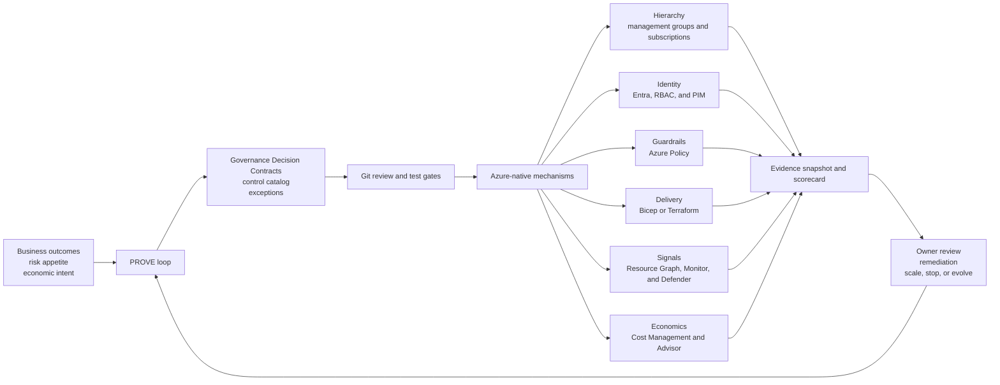

# Governance Evidence Lab

> An independent learning project and reference implementation for governing environments built on Microsoft Azure.

- **Status:** `learning-prototype`
- **Current release target:** `v0.1 — read-only governance baseline and decision pack`
- **Validation scope:** documentation, schemas, local fixtures, and query review only; no Azure deployment has been validated yet
- **Last source review:** 2026-09-09

Governance Evidence Lab turns business risk and executive intent into version-controlled control decisions, Azure-native implementation choices, testable evidence, time-bound exceptions, and measurable economics. It is designed to help leaders, architects, engineers, governance teams, FinOps practitioners, and learners move from “we need better cloud governance” to a safe and reviewable operating model.

This repository is not affiliated with or endorsed by Microsoft. It is not Microsoft's Agent Governance Toolkit, a Microsoft product, or a compliance certification service. See [NOTICE.md](NOTICE.md).

## Product snapshot

| Question | Answer |
|---|---|
| What is it? | A public learning lab, decision framework, and emerging reference implementation for Azure governance. |
| What problem does it solve? | Governance decisions are often scattered across slides, portal settings, scripts, tickets, and tribal knowledge, making ownership, impact, evidence, and cost hard to trace. |
| What does it produce? | Governance Decision Contracts, control and exception records, inventory queries, rollout guidance, scorecards, learning lessons, and—later—tested automation. |
| Who is it for? | Executives, Cloud Centers of Excellence, platform teams, architects, security and risk teams, FinOps teams, workload owners, auditors, and learners. |
| What is the first safe use? | Local learning or a read-only assessment of one sandbox subscription. |
| Is it production ready? | No. The current version is a documentation-first learning prototype. |

## The problem

Azure provides strong building blocks for hierarchy, access, policy, inventory, security posture, monitoring, and cost management. The harder problem is connecting those capabilities into one operating loop that answers:

- Which business risk or outcome justifies this control?
- Who can decide, implement, accept an exception, and fund the work?
- At what Azure scope should the control apply?
- How will it be tested before broad enforcement?
- What evidence shows that it operated as intended?
- What friction, operating cost, and economic value did it create?
- When should it be changed, rolled back, or retired?

The Lab makes those connections explicit and reviewable.

## What it is—and is not

### It is

- An evidence-oriented governance learning system.
- A bridge between executive decisions and technical controls.
- A safe, progressive path from discovery to selective enforcement.
- A place to learn Azure Management Groups, subscriptions, Azure Policy, Azure RBAC, Privileged Identity Management, Azure Resource Graph, Cost Management, Defender for Cloud, Azure Monitor, and infrastructure as code.
- A set of original templates, schemas, mappings, tests, and lessons that will mature through observed results.

### It is not

- A replacement for the Microsoft Cloud Adoption Framework or Azure Landing Zones.
- A fork of Microsoft's FinOps toolkit, Enterprise Azure Policy as Code, or Azure Governance Visualizer.
- A turnkey landing zone, managed service, or new Azure control plane.
- Proof of regulatory compliance, a security guarantee, or legal advice.
- Permission to deploy tenant-wide controls without local review.
- Production-ready software in its current state.

## The original operating method: PROVE

The Lab uses the **PROVE governance loop**:

1. **Profile** the business outcome, estate, ownership, constraints, and current evidence.
2. **Resolve** risks, tolerances, scope, decision rights, and economic intent.
3. **Operationalize** the minimum viable guardrails through native services and code.
4. **Verify** control behavior, evidence quality, workload friction, risk reduction, and cost.
5. **Evolve** controls, exceptions, architecture, and investment from observed results.

The central artifact is a **Governance Decision Contract**:

```text
business risk or outcome
  → control objective
  → Azure scope and mechanism
  → accountable owner
  → evidence and test
  → exception and expiry
  → economic metric
  → rollout, rollback, and stop rule
```

Read the [PROVE method](framework/prove-method.md) and inspect the [example contract](framework/templates/governance-decision-contract.example.json).

## Capability map

| Capability | Azure building blocks | Lab contribution | v0.1 state |
|---|---|---|---|
| Strategy and accountability | Cloud Adoption Framework guidance | Charter, decision rights, RACI, success and stop gates | Drafted |
| Resource organization | Tenants, management groups, subscriptions, resource groups | Scope decisions and subscription intake | Designed |
| Identity and access | Microsoft Entra ID, Azure RBAC, PIM, managed identities | Least-privilege and evidence patterns | Designed |
| Guardrails | Azure Policy definitions, initiatives, assignments, exemptions | Risk-to-control mapping and safe rollout | Designed; no deployment |
| Inventory and evidence | Azure Resource Graph, Policy Insights, activity and resource logs | Query pack and evidence contract | Initial queries; tenant test pending |
| Security posture | Defender for Cloud and Microsoft Cloud Security Benchmark | Finding ownership and exception integration | Planned |
| FinOps | Cost Management, Advisor, budgets, anomaly alerts, Microsoft FinOps toolkit | Governance economics and value-realization model | Drafted |
| Delivery | Git, pull requests, Bicep or Terraform, deployment stacks | Quality gates, canary sequence, rollback decisions | Designed; automation planned |
| Learning | Microsoft documentation and sanitized fixtures | Public lessons, source register, validation journal | Started |

## Who it is for

| Audience | Primary value |
|---|---|
| CIO, CTO, CISO, and CFO | Investment, risk, operating-model, and scale decisions |
| Cloud CoE and platform leaders | A progressive governance service rather than a one-time control project |
| Enterprise and cloud architects | Capability map, reference architecture, and decision records |
| Security, IAM, risk, compliance, and audit | Control ownership, exemptions, test evidence, and limitations |
| FinOps practitioners | Allocation, budgets, optimization governance, and realized-value tracking |
| Platform engineers | Policy-as-code lifecycle, inventory queries, tests, and rollout gates |
| Workload teams | Clear paved-road expectations and a bounded exception path |
| Learners and community reviewers | A source-traceable path from concepts to safe implementation |

It is not yet suitable for an organization seeking an unsupported script to enforce controls immediately across production subscriptions.

## Benefits and trade-offs

| Potential benefit | Corresponding trade-off |
|---|---|
| Repeatable, reviewable governance decisions | Requires disciplined ownership and repository maintenance |
| Progressive enforcement reduces avoidable blast radius | Takes longer than a portal-first “big bang” assignment |
| Native Azure capabilities reduce unnecessary reinvention | Creates dependency on changing Azure services and APIs |
| Explicit evidence and exception expiry improve auditability | Evidence collection, retention, and review have costs |
| Shared guardrails can accelerate workload onboarding | Poorly designed controls can block delivery or encourage shadow IT |
| FinOps is linked to governance decisions | Tags, budgets, and recommendations alone do not prove savings |

See [Challenges and trade-offs](docs/challenges-and-tradeoffs.md) for the full register.

## Architecture at a glance



The Lab composes Azure services; it does not recreate them. Read the [reference architecture](docs/architecture.md).

## FinOps position

The Lab treats FinOps in two directions:

1. **Govern cloud economics:** allocation metadata, budget and anomaly response, expensive-SKU guardrails, idle-resource review, commitment utilization, showback or chargeback, and unit economics.
2. **Measure the cost of governance:** engineering effort, monitoring ingestion and retention, optional security plans, pipeline operations, exception handling, remediation, training, and workload-team friction.

Benefits are recorded separately as cash savings, cost avoidance, capacity release, revenue enablement, or risk reduction. Recommendation value is not claimed as realized savings. See [FinOps and governance economics](docs/finops.md).

## Safe ways to start

### Mode 1 — Local learning

- No Azure tenant or credentials.
- Read the executive and technical material.
- Complete a Governance Decision Contract using synthetic facts.
- Review and adapt the sample Resource Graph queries without executing them.

### Mode 2 — Read-only assessment

- Use one sandbox subscription.
- Begin with Azure `Reader`; add separate, explicitly approved read roles only when required.
- Run inventory queries and timestamp the output.
- Report inaccessible or stale scope as **unknown**, never as compliant or empty.
- Sanitize tenant IDs, subscription IDs, resource names, costs, and architecture details before committing anything.

### Mode 3 — Audit-only sandbox pilot

- Requires a separately authorized deployment identity and change approval.
- Validate infrastructure code and inspect `what-if` or `plan` output.
- Start with audit or disabled enforcement at a narrow scope.
- Observe representative workloads, approve time-bound exemptions, and define rollback.
- Move toward deny, modify, or remediation only after explicit evidence gates pass.

The recommended sequence is:

```text
local simulation
  → read-only discovery
  → evidence baseline
  → sandbox audit
  → canary subscription
  → targeted remediation
  → selective enforcement
  → staged scale
```

Follow the [environment onboarding guide](docs/environment-onboarding.md) and [technical implementation guide](docs/technical-implementation.md).

## Documentation map

- [Executive brief](EXECUTIVE-BRIEF.md) — the five-minute investment and operating decision.
- [Reference architecture](docs/architecture.md) — logical layers, trust boundaries, and control flow.
- [Technical implementation](docs/technical-implementation.md) — tooling choices, delivery stages, permissions, testing, and rollback.
- [Environment onboarding](docs/environment-onboarding.md) — local, read-only, greenfield, and brownfield entry paths.
- [FinOps and governance economics](docs/finops.md) — allocation, optimization, toolkit cost, and value realization.
- [Operating model](docs/operating-model.md) — roles, decision rights, control lifecycle, and exceptions.
- [Control catalog](docs/control-catalog.md) — initial control objectives and minimum evidence.
- [Maturity model](docs/maturity-model.md) — evidence-based maturity by capability.
- [Challenges and trade-offs](docs/challenges-and-tradeoffs.md) — risks, signals, mitigations, and owners.
- [Learning path](docs/learning-path.md) — eight practical learning sprints.
- [Source register](docs/source-register.md) — primary sources, claims, dates, and revalidation triggers.
- [Roadmap](ROADMAP.md) — build sequence and exit gates.

## Current maturity

| Item | Maturity | Evidence |
|---|---|---|
| Product and executive narrative | Learning prototype | Repository documents |
| PROVE method | Learning prototype | Method and contract schema |
| Governance Decision Contract | Locally testable | JSON example and schema |
| Resource Graph queries | Draft | Static review only; tenant validation pending |
| Azure Policy and IaC deployment | Planned | No executable deployment package yet |
| Sandbox validation | Not started | No observed Azure results |
| Limited production pilot | Out of scope for v0.1 | Requires organizational authority and environment |

Unknowns are intentionally visible. A green dashboard based on incomplete permissions or stale data is worse than an honest gap.

## Important current platform notes

- Microsoft documents an Azure landing zone as a platform foundation plus application landing zones; the Lab complements that model rather than replacing it.
- Azure Policy assignments should be deployed progressively and tested before broad enforcement.
- Azure Resource Graph results are authorization-trimmed and indexed with some latency.
- Azure budgets notify; they are not a hard spending cap.
- Azure Blueprints entered phased retirement in 2026 and is scheduled to retire on January 31, 2027. New Lab implementation will use current IaC patterns, template specs, or deployment stacks where appropriate.

These statements and their primary references are recorded in the [source register](docs/source-register.md).

## Independent IP and provenance

The project’s original contribution is the specific PROVE method, Governance Decision Contract, control and maturity models, templates, mappings, queries, tests, and lessons developed here. General cloud-governance concepts and Microsoft product capabilities remain the property and work of their respective owners.

Only public sources and synthetic examples belong in this repository. Do not contribute employer, client, tenant, billing, security, or other confidential information.

## License and contribution status

This initial draft is copyright-protected and does not yet grant an open-source license. Public review is welcome, but reuse and external code contributions are deferred until the repository owner selects an intentional documentation and code license. See [LICENSE.md](LICENSE.md) and [CONTRIBUTING.md](CONTRIBUTING.md).
