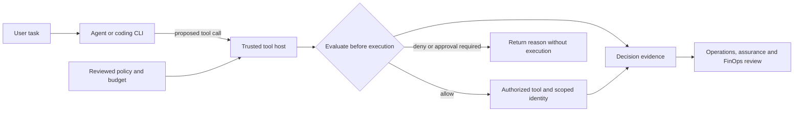

# Microsoft Agent Governance Toolkit (AGT) — Architecture Review & Hands-on Lab

Learn how an AI agent's proposed action becomes an enforced decision, a bounded cost, and reviewable evidence. Run a local lab, connect Codex or Gemini CLI, then review how those controls fit into an enterprise Azure architecture.

This is an independent companion to **Microsoft's [Agent Governance Toolkit](https://github.com/microsoft/agent-governance-toolkit)**. AGT means **Agent Governance Toolkit**, not Azure Governance Toolkit. Azure Policy, identity, landing zones, and Cost Management provide complementary platform controls. [Attribution](NOTICE.md).

Repository: [shibinantony/agt-architecture-lab](https://github.com/shibinantony/agt-architecture-lab).

**Start here:** [Run the lab](docs/lab-guide.md) · [Choose your path](docs/learning-path.md) · [Architecture review](docs/architecture.md) · [CXO brief](EXECUTIVE-BRIEF.md)

## What you can run

A synthetic cloud-operations assistant lists inventory, estimates resource cost, and builds a governance report. A YAML policy controls which requests reach a tool handler. Deployment requests stop for approval; deletion is denied; a session budget blocks further chargeable calls. Evaluated requests produce structured evidence.

The default lab makes **no model API calls and no Azure changes**. It uses an original policy emulator. Its YAML is a lab format, not an AGT or ACS manifest. The [AGT reference](docs/agt-reference.md) maps concepts and links Microsoft's actual runtime and examples.

| Mode | What runs | What it establishes |
|---|---|---|
| Offline demo | Python, YAML and synthetic tools | Repeatable allow, deny, approval, scope and budget behavior |
| MCP integration | The same tools served to Codex or Gemini CLI | Enforcement on calls reaching this MCP server |
| Actual AGT example | Pinned Microsoft AGT development source and its wrapper YAML; native build required | One allowed read; three denied actions must never reach the handler |
| Enterprise design | Architecture, operating model, FinOps and review templates | Decisions and additional controls needed for a pilot |

Run the [actual AGT example](examples/upstream-agt/README.md) in its separate environment after the guided emulator lab. It uses an immutable development snapshot because released packages constrain a security-sensitive dependency below its patched version. Its native build is an advanced exercise, separate from the beginner setup below. The [upstream reference](docs/agt-reference.md) explains the selected source, newer ACS APIs and version differences.

MCP integration does not govern a client's other tools, shell, files, model traffic, or credentials. A real CLI session may incur provider charges. [Boundaries and verification](docs/technical-implementation.md).

## Run it in five minutes

Prerequisites: Git and Python 3.11 or later. Clone the repository:

```shell
git clone https://github.com/shibinantony/agt-architecture-lab.git
cd agt-architecture-lab
```

From the repository root on Windows:

```powershell
py -3 -m venv .venv
.\.venv\Scripts\python.exe -m pip install -r requirements-bootstrap.txt
.\.venv\Scripts\python.exe -m pip install -r requirements.txt
.\.venv\Scripts\python.exe -m lab demo
```

On macOS/Linux:

```bash
python3 -m venv .venv
.venv/bin/python -m pip install -r requirements-bootstrap.txt
.venv/bin/python -m pip install -r requirements.txt
.venv/bin/python -m lab demo
```

Inspect the decisions and evidence under `artifacts/lab/<session-id>/`. Follow the [walkthrough](docs/lab-guide.md) to change [policy.yaml](lab/policy.yaml), explain results, and connect a client using the [MCP instructions](docs/cli-integration.md).

## Choose your route

| Audience | Start | Practical outcome |
|---|---|---|
| Beginner engineer | [Guided lab](docs/lab-guide.md) | Run the demo and explain why a denied call never executes |
| Intermediate engineer | [CLI integration](docs/cli-integration.md) | Connect a client, change policy and inspect evidence |
| Advanced engineer | [Implementation](docs/technical-implementation.md) and [AGT reference](docs/agt-reference.md) | Test bypass paths, concurrency, failure handling and migration |
| Architect | [Architecture](docs/architecture.md) | Place runtime enforcement, gateway, identity, data and platform controls |
| Director / engineering leader | [Operating model](docs/operating-model.md) | Assign ownership, pilot gates, support and adoption measures |
| CIO / CTO / CISO / CFO | [Executive brief](EXECUTIVE-BRIEF.md) | Decide what to fund and what evidence permits expansion |

Each route has exercises and completion criteria in the [learning path](docs/learning-path.md).

## Where governance sits



The local tool host emulates this pattern. An enterprise AGT/ACS integration supplies decisions at the host's checkpoints; the host enforces them. An AI gateway controls routed model/API traffic, Entra and RBAC constrain authority, Azure Policy governs resource configuration, and observability supplies operational evidence. See the [full architecture and sequence](docs/architecture.md).

## What value to measure

| Benefit hypothesis | Evidence to collect |
|---|---|
| Reduce unauthorized tool execution | Negative tests and enforcement at every reachable execution path |
| Explain decisions during review | Policy version, reason, execution result and evidence completeness |
| Limit waste from runaway work | Budget rejects, retry volume, actual usage and successful-task unit cost |
| Give teams a usable approved path | Onboarding time, task completion, false denials and approval waiting time |
| Make rollout decisions credible | Pilot results, operating owners, cost, rollback and residual risks |

The lab's monetary values are synthetic. They are neither vendor prices nor realized savings. [FinOps](docs/finops.md) includes a worked example and production metering design.

## Repository map

- [lab/](lab/) — executable emulator, policy, synthetic data and demo.
- [examples/upstream-agt/](examples/upstream-agt/README.md) — actual Microsoft AGT package and runnable allow/deny policy.
- [integrations/](integrations/) — MCP server and client configuration examples.
- [tests/](tests/) — runtime, protocol, schema and repository validation.
- [docs/](docs/) — role-based learning, architecture, operations and sources.
- [framework/](framework/) — PROVE method, decision contracts, charter and exceptions.
- [toolkit/queries/](toolkit/queries/README.md) — supplementary Azure Resource Graph examples; sandbox execution remains unverified.

## Validation and maturity

Install `requirements-bootstrap.txt` and then `requirements-dev.txt` in the isolated environment, then run `python -m unittest discover -s tests -v`, `python tests/check_links.py` and `./tests/Test-Repository.ps1`. The [workflow](.github/workflows/repository-validation.yml) runs checks and the offline demo. The [validation record](docs/validation.md) separates local observations from untested live integrations.

The canonical repository name is `agt-architecture-lab`. Production isolation, distributed metering, authenticated approvals, cloud deployment and provider validation remain [explicit next gates](ROADMAP.md).

Original code, documentation, schemas, templates and examples are licensed under the [MIT License](LICENSE.md), copyright 2026 Shibin Antony. You may use, adapt and redistribute them, including commercially, while preserving the license and copyright notice. Dependencies and linked vendor material retain their own terms; see [third-party notices](THIRD-PARTY-NOTICES.md).

[Sources](docs/source-register.md) · [Security](SECURITY.md) · [Contributing](CONTRIBUTING.md).
