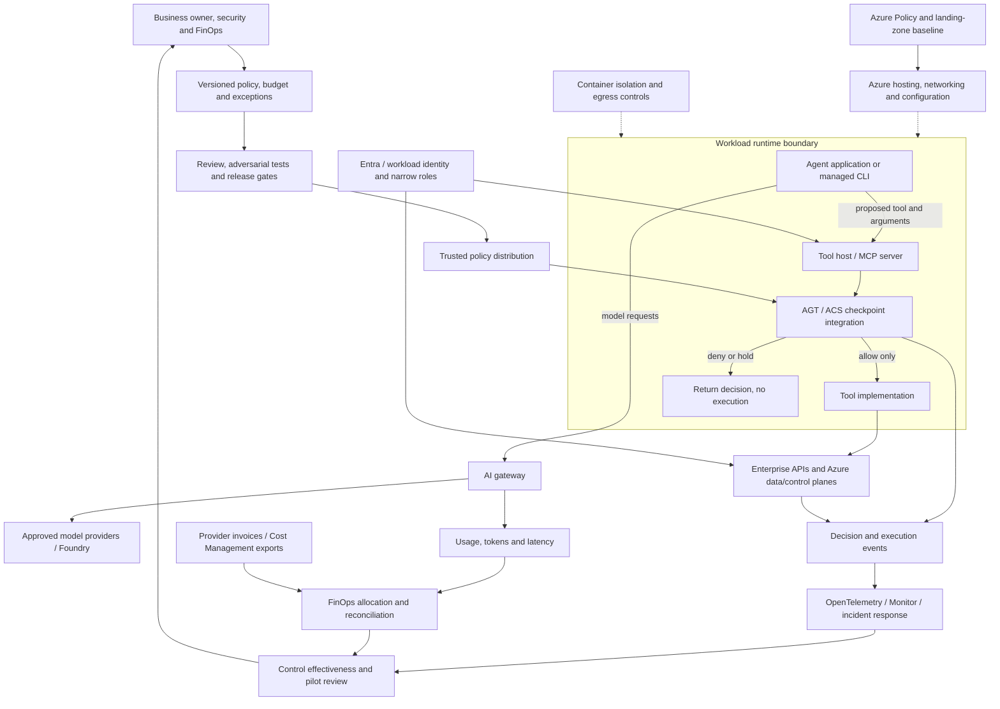

# Architecture review: AGT in the enterprise system

The central question is: **which trusted component can stop an agent's proposed action before it reaches a privileged tool?** A prompt describes desired behavior; a tool host can enforce a decision. Microsoft's [AGT](https://github.com/microsoft/agent-governance-toolkit) supplies agent-governance components; its current policy direction uses the Agent Control Specification (ACS). See the version-specific [upstream reference](agt-reference.md).

This is a proposed integration architecture. The executable lab implements the tool-host boundary with an original emulator; it does not deploy the services below.

## End-to-end placement



Only traffic routed through an enforcement point is covered. A coding CLI's built-in shell or another MCP server is a separate path. In an enterprise deployment, isolate the agent, remove direct privileged credentials, restrict egress, and make the governed host the only route to the protected operation. A CLI on an unrestricted developer machine cannot supply that boundary through configuration alone.

## Distinct responsibilities

| Layer | Enforces or observes | Does not establish by itself | Primary reference |
|---|---|---|---|
| AGT / ACS host integration | Action decisions at instrumented checkpoints | OS isolation or interception of code that bypasses the host | [AGT](https://github.com/microsoft/agent-governance-toolkit) |
| MCP | Tool discovery and invocation | Authorization or trustworthy arguments automatically | [MCP architecture](https://modelcontextprotocol.io/docs/learn/architecture) |
| Entra / Azure RBAC | Identity and operations at a resource scope | Whether an authorized action is appropriate for this task | [RBAC](https://learn.microsoft.com/en-us/azure/role-based-access-control/overview) |
| AI gateway | Controls and telemetry for routed model/API traffic | Interception of local tools or files | [API Management](https://learn.microsoft.com/en-us/azure/api-management/genai-gateway-capabilities) |
| Content safety / data protection | Inspection of selected content flows | Permission to run a tool | [Content Safety](https://learn.microsoft.com/en-us/azure/ai-services/content-safety/overview) |
| Azure Policy / landing zone | Resource configuration and platform foundation | Evaluation of every agent tool call | [Policy](https://learn.microsoft.com/en-us/azure/governance/policy/overview), [landing zones](https://learn.microsoft.com/en-us/azure/cloud-adoption-framework/ready/landing-zone/) |
| FinOps / Cost Management | Allocation, forecasts, reconciliation and ownership | An instantaneous global spending cap | [Budgets](https://learn.microsoft.com/en-us/azure/cost-management-billing/costs/tutorial-acm-create-budgets), [FinOps toolkit](https://github.com/microsoft/finops-toolkit) |

## One request, from intent to evidence

```mermaid
sequenceDiagram
    participant C as Agent / CLI
    participant H as Trusted tool host
    participant P as Policy and budget evaluator
    participant E as Evidence sink
    participant T as Scoped tool
    C->>H: Tool name and untrusted arguments
    H->>H: Validate shape; obtain trusted context
    H->>P: Tool, scope, policy version and budget
    P-->>H: Allow / deny / approval required
    H->>E: Record decision before side effect
    alt Allow and evidence accepted
        H->>T: Invoke validated operation
        T-->>H: Result and observed usage
        H->>E: Record completion/failure and usage
        H-->>C: Result and decision reference
    else Deny, pending approval or evidence unavailable
        H-->>C: Refuse/hold; no execution
    end
```

Production budgeting should reserve a worst-case cost atomically before execution and reconcile actual usage afterward. Calls that fail after sending a request can still cost money; an unknown completion is not permission to retry indefinitely. The lab uses trusted fixed synthetic costs and one runtime instance. This is the lab's design, not a claim that every AGT component uses pre-execution reservations; [upstream cost semantics differ](agt-reference.md).

## Concrete example

An engineer asks, “Review the sandbox inventory and suggest a cheaper configuration.” Inventory and cost-estimation tools run against synthetic data. A subsequent deployment request returns `require_approval`; a deletion request returns `deny`. Only an allowed request enters a handler.

In production, inventory could use a Reader-scoped identity and Azure Resource Graph. Deployment would use a separate executor after verified approval bound to the exact request. The agent should never receive that deployment credential. [Query examples](../toolkit/queries/README.md) provide background, not a wired cloud adapter.

## Threat and failure review

| Failure or attack | Required response | Lab / production boundary |
|---|---|---|
| Prompt injection asks to ignore policy | Evaluate in trusted host | Demonstrated for lab calls; no universal injection-prevention claim |
| Caller supplies cheaper cost or stronger identity | Reject unsupported arguments; derive authority server-side | Synthetic actor and costs; real identity needs authentication |
| Malformed or missing policy | Fail startup before tools become usable | Runtime tests |
| Concurrent requests overspend | Atomic reservation shared by all workers | In-process lock; distributed ledger needed in production |
| Approval forged in tool arguments | Verify external authorization separately | Lab never executes approval-required requests |
| Evidence sink fails before dispatch | Refuse before side effects and report incident | Local tests; production needs durable sink/recovery |
| Completion evidence fails after dispatch | Close the session, report uncertainty and reconcile | An action may already have occurred; do not infer absence or retry blindly |
| Agent edits policy or restarts server | Protect configuration and preserve trusted state | Local files are editable; budget resets on restart |
| Direct shell/API bypass | Remove credentials, constrain egress, isolate | Outside MCP demonstration |
| Sensitive data enters requests/results | Minimize evidence and inspect data before egress | Synthetic fixture only; no complete DLP engine |
| Result lost after a write | Correlate and reconcile before retry | No real writes; production idempotency design needed |

## Architect's review deliverable

Annotate the diagram with trust boundaries. Identify each policy owner, identity authenticator, alternate execution path, update mechanism, global spend ledger, approval verifier, evidence owner, and rollback authority. Create a [decision contract](../framework/templates/agent-governance-decision.example.json) and an [exception record](../framework/templates/exception-record.md).

A sandbox pilot needs evidence for bypass tests, audit failure handling, ownership, metering and rollback. The [control catalog](control-catalog.md), [operating model](operating-model.md) and [FinOps guide](finops.md) turn that review into owned work.
