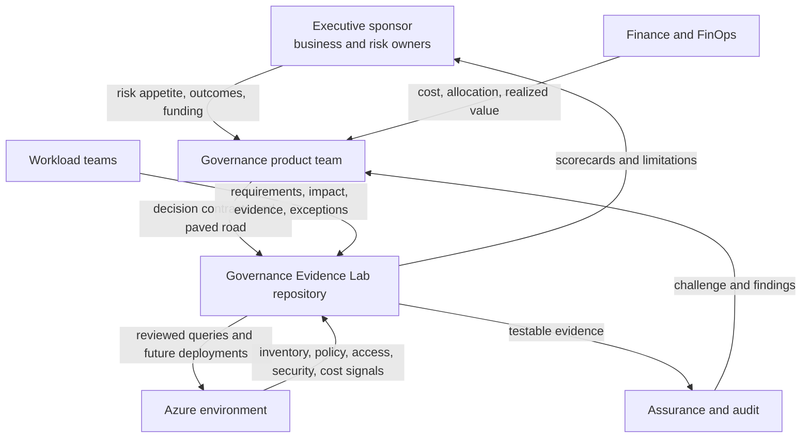
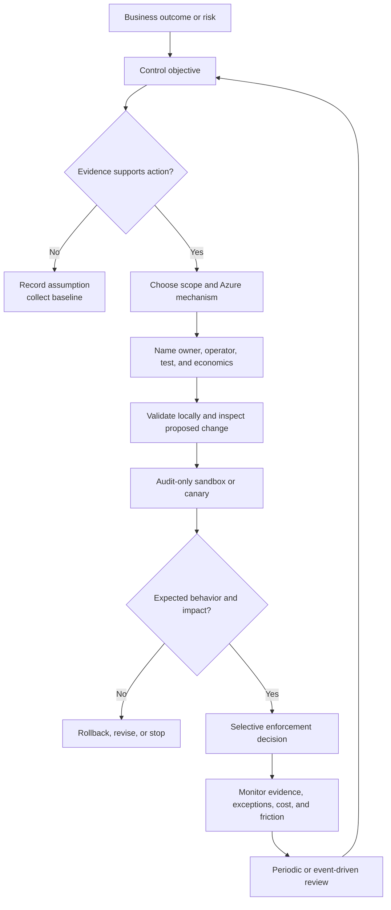
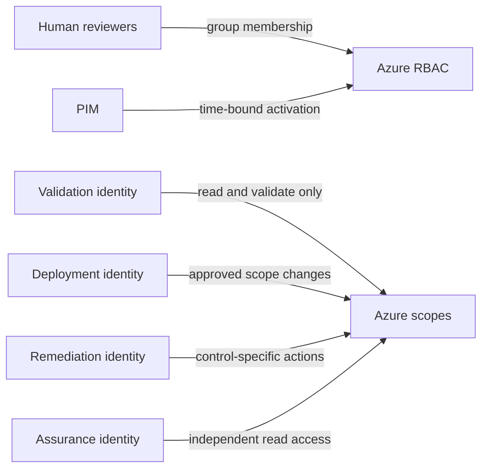

# Reference architecture

## Purpose

The architecture connects business outcomes and risks to Azure-native controls and reconstructable evidence. It is a control lifecycle, not a new Azure control plane.

Microsoft describes an Azure landing zone as a platform landing zone plus application landing zones. Governance Evidence Lab sits alongside that model: it helps decide, document, test, and review guardrails; it does not replace the landing-zone architecture or its implementation accelerators.

## Architecture principles

1. **Business risk before mechanism.** Do not begin with a policy definition looking for a problem.
2. **Native before custom.** Evaluate current built-in capabilities and supported accelerators before adding code.
3. **Read before write.** Establish scope, permissions, inventory, and baseline evidence before enforcement.
4. **Progressive exposure.** Move from local fixtures to sandbox audit, canary, and selective enforcement.
5. **Least privilege by function.** Keep discovery, deployment, remediation, and assurance identities separate where practical.
6. **Evidence is an output.** A control is incomplete until its decision, deployment, result, exception, and review can be reconstructed.
7. **Unknown is a valid result.** Inaccessible or stale data must never be represented as compliant.
8. **Exceptions are controlled decisions.** They require scope, owner, reason, compensating control, expiry, and review.
9. **Economics are part of control design.** Include lifecycle cost and delivery friction, not only expected loss reduction.
10. **Every control can be reversed or retired.** Define rollback and stop conditions before scale.

## Context



## Logical layers

| Layer | Responsibility | Azure capabilities | Lab artifact |
|---|---|---|---|
| Intent and accountability | Define outcome, risk, tolerance, decision rights, funding, and service levels | Cloud Adoption Framework guidance | Charter, RACI, decision contract |
| Resource organization | Establish control inheritance and workload boundaries | Tenant, management groups, subscriptions, resource groups | Scope model and subscription intake |
| Identity and authority | Determine who and what can inspect, change, remediate, and approve | Microsoft Entra groups and identities, Azure RBAC, PIM | Permission model and access evidence |
| Guardrails | Prevent, detect, or correct disallowed resource state | Azure Policy definitions, initiatives, assignments, exemptions, remediation | Control catalog and policy lifecycle |
| Delivery | Version, review, validate, preview, and deploy change | Git, GitHub Actions, Bicep or Terraform, template specs, deployment stacks | Pipeline gates and deployment evidence |
| Inventory and posture | Discover resources, relationships, assignments, changes, and findings | Azure Resource Graph, Policy Insights, Defender for Cloud | Queries and timestamped evidence snapshot |
| Observability and response | Detect changes and failures and route action | Activity logs, diagnostic settings, Azure Monitor, Log Analytics, action groups | Monitoring contract and response record |
| Economics | Allocate, alert, forecast, optimize, and measure value | Cost Management, Advisor, budgets, anomaly alerts, FinOps toolkit | FinOps scorecard and value ledger |
| Assurance | Test design and operating effectiveness | Native results plus independent sampling | Test result, finding, remediation, and review |

## Governance Decision Contract flow



## Resource hierarchy

The target hierarchy is an organizational decision, not a toolkit default. The Lab follows these design heuristics:

- Use management groups primarily to group subscriptions that need common policy, security, or compliance settings.
- Keep the hierarchy reasonably flat and avoid copying a volatile organization chart.
- Limit assignments at tenant root because inherited impact is harder to isolate.
- Maintain explicit sandbox and decommissioned paths.
- Treat subscriptions as important workload, management, billing, and scale boundaries.
- Give platform teams only the broad access they need; avoid broad workload-team RBAC at management-group scope.

The current Microsoft guidance is linked in the [source register](source-register.md).

## Identity and permissions



Key rules:

- Assign roles to groups or managed identities rather than individual users when possible.
- Use the narrowest practical role and scope.
- Distinguish Azure control-plane actions from data-plane access.
- Do not grant a read-only collector write permissions for convenience.
- Treat Owner and User Access Administrator as privileged and time-bound where available.
- Grant remediation identities only the operations required by the relevant policy and scope.
- Record permission gaps because inventory is authorization-trimmed.

## Policy lifecycle

1. Link a documented risk to a control objective.
2. Evaluate built-in definitions and current versions before authoring a custom definition.
3. Group related definitions into a coherent initiative only when common ownership and rollout justify it.
4. Validate definition and assignment structure in CI.
5. Preview scope and infrastructure change.
6. Begin with audit or disabled enforcement at a narrow sandbox scope.
7. Compare expected policy applicability and observed results.
8. Test representative compliant, noncompliant, exempt, and failure cases.
9. Review remediation permissions separately from evaluation behavior.
10. Expand by canary tiers with application-health and compliance gates.
11. Record time-bound exemptions and compensating controls.
12. Monitor built-in versions, false positives, incidents, cost, and delivery friction.
13. Scale, revise, roll back, or retire based on evidence.

## Evidence model

Every material control should be reconstructable through linked records:

```text
risk/outcome
  ↔ decision contract and approval
  ↔ control definition and version
  ↔ assignment, scope, parameters, and exclusions
  ↔ deployment identity and change result
  ↔ compliance or inventory observation and timestamp
  ↔ exception and expiry, if used
  ↔ remediation or incident
  ↔ cost, friction, and outcome review
```

The v0.1 [Governance Decision Contract schema](../framework/schemas/governance-decision-contract.schema.json) normalizes the decision layer. A future evidence snapshot schema will represent collected results without storing unnecessary tenant details.

## Trust boundaries and failure modes

| Boundary | Failure or abuse | Architectural response |
|---|---|---|
| Human intent to contract | Vague risk or unaccountable control | Require outcome, owner, evidence, test, and stop rule |
| Repository to Azure | Unreviewed or over-broad deployment | Protected review, preview, separate identity, narrow scope, manual gate |
| Policy assignment to workload | False positive or unexpected denial | Audit first, representative tests, canary, exemption, rollback |
| Remediation identity | Excessive privilege or unintended mutation | Control-specific roles, separate approval, dry-run where possible, bounded scope |
| Azure to evidence collector | Missing permissions or stale index | Coverage report, timestamp, pagination, retry, explicit unknown state |
| Evidence store | Sensitive data disclosure or tampering | Minimize, sanitize, restrict, integrity-check, and retain intentionally |
| Exception path | Permanent or over-broad waiver | Owner, scope, reason, compensating control, expiry, usage and review |
| FinOps signal to savings claim | Recommendation presented as realized value | Verify implementation and observed effect; separate value categories |
| Desired-state cleanup | Tool deletes resources it did not safely own | Explicit ownership boundary, detach-first default, reviewed deletion plan |

## Greenfield and brownfield

### Greenfield

Start with a landing-zone design and subscription-vending path. Apply a small inherited baseline before workloads arrive, but still validate in sandbox and canary tiers. Greenfield does not eliminate the need for ownership, exceptions, or operational support.

### Brownfield

Discover first. Map existing hierarchies, assignments, access, resources, costs, deployment ownership, exemptions, and business criticality. Do not restructure management groups or introduce broad deny, modify, remediation, or deployment-stack ownership until dependencies and rollback are understood.

## Deployment technology position

- The repository will choose one reference path—Bicep or Terraform—through an architecture decision before adding deployment code.
- It can document adapters for the other path later.
- Enterprise Azure Policy as Code can be evaluated rather than rebuilding enterprise policy orchestration; its ownership and desired-state deletion boundaries must be explicit.
- Azure Blueprints is excluded from new design because Microsoft has announced retirement on January 31, 2027 after phased retirement began in 2026.
- Deployment stacks may be evaluated for lifecycle ownership, but `actionOnUnmanage` and deny settings require deliberate tests. The safe default for an initial lab is detach, not delete.

## Architecture decisions still open

| Decision | Options | Required evidence |
|---|---|---|
| Reference IaC path | Bicep or Terraform | Target audience, skills, ALZ alignment, testability, maintenance |
| Policy lifecycle engine | Native Bicep/Terraform or EPAC integration | Scale, ownership, drift, desired-state behavior |
| Evidence store | Git fixture, Azure Storage, Log Analytics, other | Sensitivity, volume, query need, integrity, retention, cost |
| Reporting | Markdown, Azure Workbook, Power BI, FinOps toolkit | Audience, freshness, access, cost, maintainability |
| License | Closed prototype, Apache-2.0/CC BY, other | IP intent, contribution model, employer obligations, legal review |
