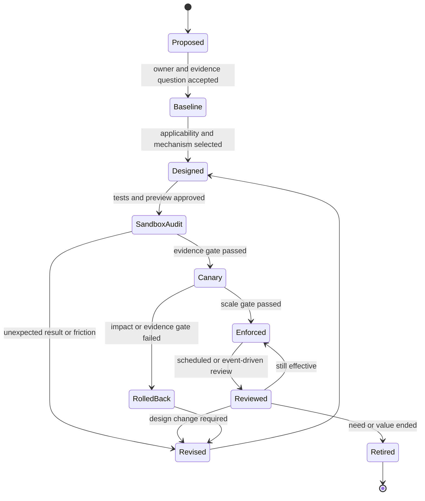

# Governance operating model

## Product mindset

Cloud governance is a continuous service to the organization, not a one-time policy deployment. Its customers are the people who fund, assure, build, operate, and consume cloud platforms. A strong governance service reduces meaningful risk while making the compliant path understandable and efficient.

## Core roles

| Role | Accountable for | Must not silently delegate |
|---|---|---|
| Executive sponsor | Mandate, risk appetite, funding, escalation | Acceptance of unresolved enterprise conflict |
| Governance product owner | Outcomes, roadmap, service levels, adoption, overall performance | Product priorities and stakeholder experience |
| Business or risk owner | Business consequence and residual-risk decision | Risk acceptance |
| Cloud platform owner | Hierarchy, landing-zone integration, technical operation, deployment identities | Platform availability and change safety |
| Security and IAM owner | Security baseline, privileged access, security exceptions | High-impact identity and security decisions |
| FinOps owner | Allocation, budget process, optimization governance, realized-value model | Financial interpretation |
| Control owner | Purpose, applicability, test, evidence, remediation expectation, review | Continued need and design effectiveness |
| Control operator | Day-to-day deployment, monitoring, and response | Escalation of failure or ambiguity |
| Workload owner | Workload implementation, impact evidence, remediation, local operation | Business impact and local residual risk |
| Exception authority | Approval of a bounded deviation within delegated authority | Exceptions outside delegated scope |
| Assurance | Independent test, sampling, and challenge | Independence of conclusion |

One person may hold multiple roles in a small organization, but the decision rights should still be named.

## Responsibility matrix

Legend: `A` accountable, `R` responsible, `C` consulted, `I` informed.

| Activity | Sponsor | Gov. product | Risk owner | Platform | Security / IAM | FinOps | Workload | Assurance |
|---|---:|---:|---:|---:|---:|---:|---:|---:|
| Set governance outcomes and tolerance | A | R | R | C | C | C | C | I |
| Design control objective | I | A | C | R | R | C | C | C |
| Select Azure mechanism and scope | I | A | C | R | C | C | C | C |
| Approve deployment | I | A | C | R | C | I | C | I |
| Accept material residual risk | I | C | A | C | C | C | C | I |
| Operate and monitor control | I | A | I | R | R | C | R | I |
| Approve bounded exception | I | A | A | C | C | C | R | I |
| Validate realized financial benefit | I | C | C | C | I | A/R | C | C |
| Test control independently | I | C | I | C | C | C | C | A/R |
| Scale, revise, or retire control | I | A/R | C | C | C | C | C | C |

Tailor this matrix; do not copy it into an organization without confirming its existing accountabilities.

## Control lifecycle

Every state transition needs an owner, date, evidence, and next review or decision trigger.

## Decision rights

### Control proposal

Anyone may propose a control. The governance product owner accepts it into analysis only when the outcome or risk, beneficiary, scope hypothesis, and accountable risk owner are identifiable.

### Technical design

The platform owner selects the implementation with control, workload, security, and FinOps input. A custom policy is justified only when current supported mechanisms do not meet the objective.

### Deployment

The approved change authority authorizes the exact environment and stage. Approval of an audit pilot is not approval of deny, modify, remediation, tenant-root assignment, management-group restructuring, or production scale.

### Risk acceptance

Only the delegated business or risk authority accepts residual risk. Platform teams can describe technical risk but should not silently accept business consequences.

### Financial recognition

FinOps or finance validates cash savings and cost avoidance. Engineers may report capacity or recommendation value but should not relabel it as realized financial benefit.

## Exception lifecycle

An exception is a governed decision, not a way to silence a dashboard.

1. **Request:** identify control, resource scope, business need, and duration.
2. **Assess:** evaluate risk, alternatives, cost, and downstream impact.
3. **Decide:** approve, reject, or require a narrower scope or compensating control.
4. **Implement:** create the Azure exemption or operating record with metadata and expiry.
5. **Monitor:** verify scope, use, compensating control, and new risk signals.
6. **Review:** close, renew with new evidence, narrow, or escalate before expiry.
7. **Reconcile:** remove obsolete technical exemptions and confirm compliance state.

Minimum fields are available in the [exception template](../framework/templates/exception-record.md).

## Governance service levels

Propose service levels and validate them during a pilot:

| Service | Measure |
|---|---|
| New control triage | Time to name owner and decide whether analysis begins |
| Workload impact review | Time to assess a complete request |
| Exception decision | Time by risk tier, excluding requester delay |
| Critical false positive | Time to acknowledge, contain, and decide rollback |
| Remediation | Time from confirmed finding to disposition by severity |
| Evidence request | Time to produce a reconstructable record |
| Policy version review | Time from material upstream change to impact decision |

Targets remain proposals until the operating team and workload owners confirm capacity and risk appetite.

## Review cadence

- **Continuous:** deployment failures, critical policy effects, privileged changes, and monitoring outages.
- **Weekly:** material exceptions, high-severity findings, rollback events, and aged remediation.
- **Monthly:** service levels, policy coverage, false positives, workload feedback, cost, and evidence gaps.
- **Quarterly:** control purpose, built-in versions, access reviews, exception renewal, realized value, and retirement candidates.
- **Event-driven:** regulation, acquisition, material incident, platform retirement, new Azure service, region expansion, or business-model change.

## Operating health measures

- Percentage of controls with named owners and current reviews.
- Percentage of findings with a disposition and due date.
- Exception count, age, expiry, and renewal rate.
- False-positive and rollback rates.
- Workload onboarding lead time.
- Failed deployments and waiting time attributable to governance.
- Evidence completeness and reconstruction time.
- Governance build/run cost and realized outcome.
- Number of controls retired or simplified based on evidence.
