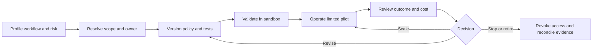

# Operating an agent governance service

An agent governance service owns the path from a proposed action to an authorized tool execution and usable evidence. This is the lab's proposed operating model for evaluating [Microsoft Agent Governance Toolkit](https://github.com/microsoft/agent-governance-toolkit) in an organization. The local emulator demonstrates selected decisions; the production roles and workflows below must be designed and validated for the actual service.

## Ownership and decision rights

| Role | Accountable for | Decision it retains |
|---|---|---|
| Executive sponsor | Mandate, funding, enterprise trade-offs | Risk appetite and expansion beyond the pilot mandate |
| Business / risk owner | Useful task outcome and business consequences | Acceptance of material residual risk |
| Governance product owner | Policy service, roadmap, adoption, support experience | Priorities, service commitments, and control retirement |
| Agent / workload owner | Agent instructions, tool selection, task quality, local operation | Whether results are fit for the business workflow |
| Platform owner | Tool gateway, execution boundary, credentials, deployments, availability | Technical release, containment, and rollback |
| Security / IAM owner | Identity, access, abuse scenarios, secret handling | Security exception decisions within delegated authority |
| Control owner | Purpose, policy version, tests, evidence, review date | Whether a rule still meets its objective |
| Approval authority | Bounded actions requiring human judgment | Approval of the exact action and scope, within its mandate |
| FinOps / finance owner | Budgets, allocation, usage reconciliation, value classification | Recognition of savings and financial limits |
| Assurance | Independent sampling and challenge | Whether available evidence supports the claim |

One person may hold several roles in a small team. Record conflicts explicitly; authors should not independently approve their own high-impact exceptions.

## Action handling

| Decision or event | Required operating response | Evidence |
|---|---|---|
| Allow | Execute only the evaluated operation with its approved arguments and identity | Policy identity, request correlation, tool result, actual usage |
| Deny | Return a useful reason and a supported next step; avoid blind retries | Denied request, reason, rule, and absence of tool execution |
| Require approval | Hold the operation pending a valid decision | Request digest, authority, scope, expiry, decision, and execution reference |
| Budget exhausted | Stop admitting billable work within that enforced scope; route to the budget owner | Remaining budget, reserved amount, decision, and ledger state |
| Policy / identity service unavailable | Follow the reviewed failure behavior for that action class | Dependency failure, observed behavior, incident owner |
| Evidence sink unavailable | Apply the approved evidence-availability rule; queue or reject as designed | Lost/queued record count, recovery, reconciliation result |

The lab's `require_approval` result is a stop for teaching, not an implemented organizational approval service. A production approval must bind the actual tool, arguments, requester, environment, and expiry. A changed request needs evaluation again; a reusable chat reply saying “approved” is insufficient authority.

## Policy lifecycle

Use [PROVE](../framework/prove-method.md) and the [agent governance decision contract](../framework/templates/agent-governance-decision.example.json) to keep intent connected to implementation.

Every transition records an owner, date, evidence, and next review trigger. Validate normal work, denied operations, malformed input, exhausted budgets, approval failures, and alternative paths to the target. A policy file change can alter authority and needs the same review discipline as an application change.

Keep an emergency procedure that revokes tool credentials or stops the execution service. Reverting a policy does not undo an external side effect; recovery for messages, writes, or deployments needs a workload-specific plan.

## Exception workflow

Use the [exception record](../framework/templates/exception-record.md) for a bounded deviation: control and version, exact agent/tool/environment scope, reason, compensating control, approver, expiry, monitoring, and closure. The template's Azure exemption reference is relevant only when an Azure Policy exemption is also involved; it does not grant agent authority.

The requester proposes the smallest deviation. The control, security, workload, and FinOps owners assess consequences. The delegated risk authority decides; the platform owner implements the exact approved scope. Review expiry and usage, then remove or renew with fresh evidence. A frequent exception is a signal to redesign the rule or the supported workflow.

## Director's adoption exercise

1. Choose one workflow, such as producing a reviewed cloud inventory report. Write its user, accepted output, existing human process, and excluded actions.
2. Complete a [governance charter](../framework/templates/governance-charter.md) with named role groups, budget owner, and escalation route. Record the agent/tool boundary as well as the Azure resource scope.
3. Use the [learning path](learning-path.md) to pair an engineer with an architect. Ask them to present one allowed decision, one denied decision, one approval boundary, and one bypass risk.
4. Baseline task completion time, accepted-result rate, human review minutes, and total cost. Set proposed pilot thresholds before reviewing pilot outcomes.
5. Plan a limited rollout with support coverage, a credential-revocation exercise, exception handling, and weekly evidence sampling.
6. Present a scale/revise/hold/stop recommendation at day 90, including adverse effects and unresolved gaps.

**Expected output:** a charter, decision contract, named operating roster, cost ledger, and phased pilot backlog. **Checkpoint:** another team can identify who approves a sensitive action, who responds at failure time, and who may stop the service.

## Service measures and cadence

| Measure | Owner | Decision it informs |
|---|---|---|
| Accepted results and human review time | Workload owner | Whether the workflow is useful |
| Approval latency and queue age | Approval authority | Whether approval capacity supports demand |
| Confirmed false-denial rate | Control owner | Whether rules need narrowing or correction |
| Unguarded action paths found | Platform / security | Whether access can expand |
| Evidence reconstruction time and missing records | Platform / assurance | Whether decisions can be investigated |
| Cost per accepted task and usage mismatch | FinOps | Whether economics and budgets are credible |
| Incident containment and recovery time | Platform | Whether the service is operable |
| Exception age and repeated renewals | Governance product owner | Whether the supported workflow needs redesign |

Define targets with the team; this repository supplies no production service-level guarantee. Review incidents continuously, queues and exceptions weekly, outcomes and economics monthly, and authority and control necessity quarterly. Revalidate after a model/provider change, AGT upgrade, new tool, changed identity boundary, incident, or material change in pricing or data sensitivity.
